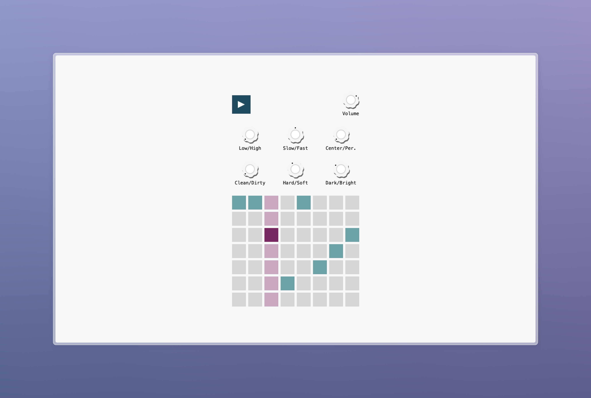

# AIS Knobs

AIS Knobs lets you experience auditory image schemas for yourself.
It is an interactive audio app built with Tone.js and Sveltekit which lets you modify
the sound of a simple synthesizer using the parameters `UP/DOWN`, `SLOW/FAST`, `CENTER/PERIPHERY`, `CLEAN/DIRTY` `HARD/SOFT` and `DARK/BRIGHT`

